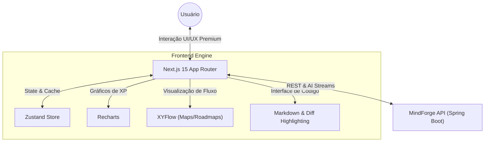

<p align="center">
  
</p>

# MindForge Frontend - AI-Native Cognitive Workspace


> **A interface cognitiva do seu Segundo Cérebro. Uma experiência de usuário fluida projetada para integrar fluxos de trabalho humanos com inteligência artificial de ponta.**

---

## 🚀 Visão do Produto

O **MindForge Frontend** é um **Workspace Cognitivo** de alta fidelidade onde a colaboração entre humano e IA é o centro da experiência. Construído com as tecnologias mais recentes do ecossistema Web, ele transforma o aprendizado e a gestão de conhecimento em um fluxo contínuo e esteticamente refinado.

Não é apenas uma ferramenta; é um acelerador de produtividade que utiliza IA para organizar, expandir e validar seu conhecimento em tempo real.

---

## 🏗️ Arquitetura & Fluxo



---

## 📐 Destaques de Engenharia & UX

### 🎨 Design System de Próxima Geração
- **Aesthetics First**: Interface baseada em **Tailwind 4**, utilizando glassmorphism, gradientes suaves e micro-interações para uma experiência premium.
- **Adaptive UI**: Dark e Light mode com contraste otimizado para longas sessões de foco.
- **Streaming UI**: Respostas de IA renderizadas em tempo real com tratamento robusto de markdown e blocos de código.

### 🧠 Módulos de Cognição
- **Mapas Mentais Dinâmicos**: Visualização e edição de conexões de conhecimento usando **XYFlow**.
- **IA Roadmaps**: Geração de trilhas de estudo personalizadas com acompanhamento de progresso.
- **Study HUD & Gamification**: Sistema de Níveis e XP integrado para manter o engajamento no aprendizado.
- **Code Review AI**: Interface especializada para análise de código com visualização de diffs propostos pela IA.

### ⚡ Performance & Stack Moderna
- **Next.js 15 & React 19**: Aproveitando o que há de mais moderno em Server Components e Actions para uma navegação instantânea.
- **Type Safety Total**: Contratos de API rigorosamente tipados para garantir estabilidade.
- **Desenvolvimento Reativo**: Feedback otimista em todas as ações (Kanban, Notas, Favoritos).

---

## 💻 Tech Stack

| Categoria | Tecnologia |
|-----------|------------|
| **Core** | **Next.js 15** (App Router) / **React 19** |
| **Styling** | **Tailwind CSS 4** / Shadcn UI |
| **State** | **Zustand** |
| **Visualização** | **XYFlow** (Mapas Mentais) / **Recharts** (XP) |
| **Editor** | **React Markdown** / **Prism** (Syntax Highlighting) |
| **Networking** | **Axios** com interceptors para Gestão de Auth |

---

## 🧩 Principais Funcionalidades

1.  **Dashboard de Produtividade**: Visão geral de métricas, progresso e atividades recentes.
2.  **Sistema de Estudos**: Gestão de cursos, anotações e agenda integrada.
3.  **Chat com Contexto AI**: Chat sempre disponível que entende o que você está fazendo no momento.
4.  **Kanban Avançado**: Organização de tarefas com drag-and-drop fluido.
5.  **Gestão de Conhecimento**: Criação e exploração de bases de conhecimento.

---

## 🚀 Como Executar

```bash
# 1. Instalação
npm install

# 2. Configuração (env.local)
NEXT_PUBLIC_API_URL=http://localhost:8080

# 3. Rodar em Dev
npm run dev
```

---

## 👨‍💻 Autor

**Matheus Dev** - Focado em criar interfaces que unem design excepcional e engenharia de IA robusta.

---

<div align="center">
  Construído com ❤️ para a comunidade MindForge
</div>
